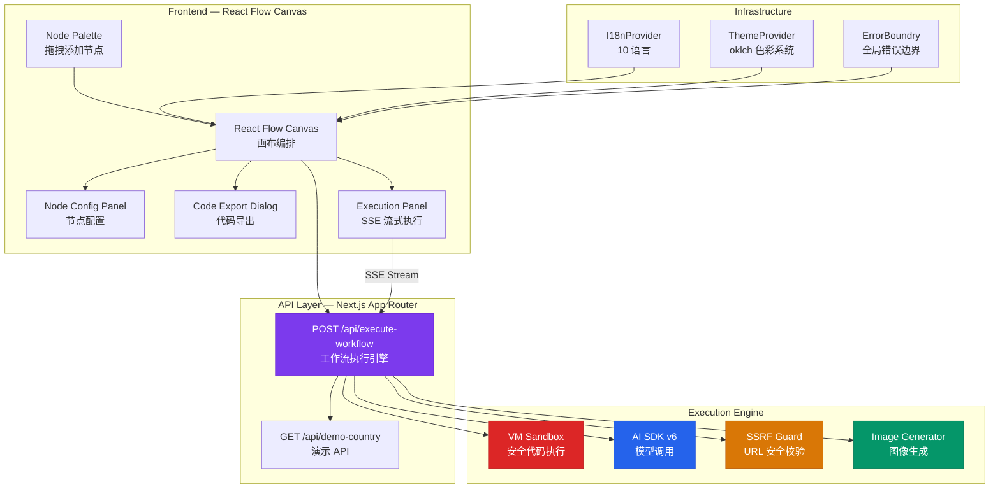
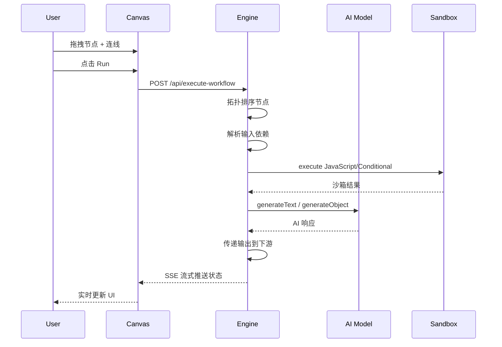

<div align="center">
  <picture>
    <source media="(prefers-color-scheme: dark)" srcset="./public/Family-002.png" />
    
  </picture>
</div>

<br />

<div align="center">

# YYC³ Agent Builder — Visual AI Workflow Builder

**CloudPivot Intelli-Matrix** · 言启千行代码，语枢万物智能

[]()
[]()
[]()
[]()
[]()

[]()
[]()
[]()
[]()
[]()

[]()
[](https://agent.yyc3.vip)

<br />

</div>

---

## 🚀 快速导航

| 章节 | 内容 |
|------|------|
| [✨ 概述](#-概述) | 项目定位与核心能力 |
| [📊 架构设计](#-架构设计) | 系统架构与数据流 |
| [🛠️ 技术栈](#️-技术栈) | 完整技术栈快照 |
| [📂 项目结构](#-项目结构) | 代码目录组织 |
| [⚡ 快速开始](#-快速开始) | 环境搭建与运行 |
| [🧩 核心功能](#-核心功能) | 节点系统与特性矩阵 |
| [📈 项目指标](#-项目指标) | 代码质量与规模量化 |
| [🌐 国际化](#-国际化) | 10 语言支持说明 |
| [🔧 配置参考](#-配置参考) | 环境变量与配置 |
| [🔄 CI/CD](#-cicd) | 自动化流水线 |

---

## ✨ 概述

**YYC³ Agent Builder** 是一个基于 **Next.js 16** + **React 19** + **React Flow** 构建的**可视化 AI 工作流编排平台**，支持拖拽式节点编排、实时流式执行、一键代码导出和 10 种语言国际化。

### 核心能力

- **🧩 可视化编排** — 拖拽 12 种节点 + 连线构建 AI 工作流
- **⚡ 实时执行** — SSE 流式执行引擎，实时反馈节点状态
- **🔌 多模型支持** — OpenAI GPT / Google Gemini / Anthropic Claude / xAI Grok
- **🔀 条件分支** — JavaScript 条件表达式，TRUE/FALSE 双路径
- **🌐 HTTP 集成** — 请求外部 API，支持变量插值
- **💻 自定义代码** — 在隔离 VM 沙箱中执行 JavaScript
- **📤 代码导出** — 一键生成 AI SDK 生产级代码
- **🌍 国际化** — 10 种语言，含阿拉伯语 RTL 支持

---

## 📊 架构设计



### 执行流程



---

## 🛠️ 技术栈

| 类别 | 技术 | 版本 | 说明 |
|------|------|------|------|
| **框架** | [Next.js](https://nextjs.org) (App Router) | 16.2.10 | React 全栈框架 |
| **UI 引擎** | [React](https://react.dev) | 19.1.0 | 声明式 UI |
| **组件库** | [shadcn/ui](https://ui.shadcn.com) (new-york) | — | 56 个 Radix UI 组件 |
| **原语** | [Radix UI](https://radix-ui.com) | latest | 无障碍 UI 原语 |
| **样式** | [Tailwind CSS](https://tailwindcss.com) v4 + oklch | 4.1.9 | 原子化 CSS |
| **流程图** | [@xyflow/react](https://xyflow.com) (React Flow) | 12.10.2 | 节点编辑器 |
| **AI SDK** | [Vercel AI SDK](https://sdk.vercel.ai) (`ai`) | 6.0.176 | 统一 AI 调用 |
| **AI Provider** | `@ai-sdk/google` / `@ai-sdk/openai` / `@ai-sdk/anthropic` | v3 / v3 / v3 | 多模型支持 |
| **表单 + 验证** | react-hook-form + [zod](https://zod.dev) | 7.60 / 4.4.3 | 输入验证 |
| **i18n** | `@yyc3/i18n-core` | ^2.4.0 | 10 语言国际化 |
| **测试** | [vitest](https://vitest.dev) + [@testing-library/react](https://testing-library.com) | 4.1.6 | 单元 + 组件测试 |
| **包管理** | [pnpm](https://pnpm.io) | 11.10.0 | 快速、磁盘高效 |
| **语言** | [TypeScript](https://typescriptlang.org) | 5.8 | strict 严格模式 |

---

## 📂 项目结构

```
yyc3-agent-builder/
├── app/                          # Next.js App Router
│   ├── api/
│   │   ├── demo-country/         # 演示 API
│   │   └── execute-workflow/     # 工作流执行引擎（SSE）
│   ├── globals.css               # 全局样式 + oklch 主题变量
│   ├── layout.tsx                # 根布局（元数据 + Provider）
│   ├── opengraph-image.tsx       # OG 图片生成
│   └── page.tsx                  # 主页面（React Flow 画布）
├── components/
│   ├── nodes/                    # 12 种工作流节点组件
│   │   ├── start-node.tsx        # 入口节点
│   │   ├── end-node.tsx          # 出口节点
│   │   ├── prompt-node.tsx       # 提示词（变量插值）
│   │   ├── text-model-node.tsx   # LLM 文本生成
│   │   ├── conditional-node.tsx  # 条件分支
│   │   ├── http-request-node.tsx # HTTP 请求
│   │   ├── javascript-node.tsx   # JS 代码执行
│   │   ├── image-generation-node.tsx # 图像生成
│   │   ├── audio-node.tsx        # 音频生成
│   │   ├── embedding-model-node.tsx  # 向量化
│   │   ├── tool-node.tsx         # 自定义工具
│   │   └── structured-output-node.tsx # 结构化输出
│   ├── ui/                       # shadcn/ui 组件（56 个）
│   ├── code-export-dialog.tsx    # 代码导出
│   ├── error-boundary.tsx        # 全局错误边界
│   ├── execution-panel.tsx       # SSE 执行面板
│   ├── language-switcher.tsx     # 10 语言切换
│   ├── node-config-panel.tsx     # 节点配置
│   ├── node-palette.tsx          # 拖拽节点面板
│   └── theme-provider.tsx        # 暗色主题（next-themes）
├── lib/
│   ├── i18n/                     # 国际化引擎
│   │   ├── config.ts             # 10 语言配置 + RTL
│   │   ├── provider.tsx          # I18nProvider + useI18n
│   │   └── index.ts              # Barrel export
│   ├── code-generator.ts         # AI SDK 代码生成器
│   ├── model-resolver.ts         # 多 provider 模型解析器
│   ├── node-registry.ts          # 节点注册表
│   ├── node-utils.ts             # 节点工具函数
│   ├── safe-executor.ts          # VM 沙箱执行器（5s 硬超时）
│   └── utils.ts                  # cn() 工具
├── public/                       # 静态资源
│   ├── CNAME                     # 自定义域名配置
│   ├── Family-002.png            # 品牌主图
│   ├── locales/                  # 翻译文件（10 语言）
│   │   ├── en/common.json
│   │   ├── zh-CN/common.json
│   │   └── ...
│   └── yyc3/                     # 全端图标资源
│       ├── Android/
│       ├── iOS/
│       ├── macOS/
│       ├── watchOS/
│       └── Web App/
├── __tests__/                    # 测试套件
│   ├── setup.ts
│   ├── helpers.ts
│   ├── lib/                      # 工具库测试
│   └── components/               # 组件测试
├── .github/workflows/
│   └── ci-cd.yml                 # CI/CD 流水线
└── docs/                         # 项目文档
```

---

## ⚡ 快速开始

### 前置条件

- [Node.js](https://nodejs.org) 20+
- [pnpm](https://pnpm.io) 11+
- AI API Keys（根据使用的模型）

### 安装与运行

```bash
# 1. 安装依赖
pnpm install

# 2. 配置环境变量
cp .env.example .env.local
# 编辑 .env.local 填入 API Keys

# 3. 启动开发服务器
pnpm dev
# → http://localhost:3146

# 4. 构建生产版本
pnpm build

# 5. 运行测试
pnpm test                    # 全部测试
pnpm test:watch              # 监听模式
pnpm test:coverage           # 覆盖率报告
```

### 测试验证（质量门禁）

每次提交前确保以下命令全部通过：

```bash
pnpm lint          # ESLint — 0 warnings
npx tsc --noEmit   # TypeScript — 0 errors
pnpm test          # Vitest — 135/135 passed
pnpm build         # Next.js build — 0 errors
```

---

## 🧩 核心功能

### 工作流节点（12 种）

| 节点 | 标识 | 说明 | 执行引擎 |
|------|------|------|----------|
| **Start** | `start` | 工作流入口 | 返回 "Workflow started" |
| **End** | `end` | 工作流出口 | 透传上游输出 |
| **Prompt** | `prompt` | 文本模板，支持 `$input1` 变量 | 变量插值 |
| **Text Model** | `textModel` | 多模型 LLM 调用 | `generateText()` |
| **Conditional** | `conditional` | JS 条件 → TRUE/FALSE 双路 | VM 沙箱 |
| **HTTP Request** | `httpRequest` | GET/POST/PUT/DELETE/PATCH | `fetch()` + SSRF 防护 |
| **JavaScript** | `javascript` | 自定义代码执行 | VM 沙箱（5s 超时） |
| **Image Generation** | `imageGeneration` | 图像生成 | Gemini Flash |
| **Audio** | `audio` | TTS 音频生成 | OpenAI TTS |
| **Embedding Model** | `embeddingModel` | 文本向量化 | OpenAI Embeddings |
| **Tool** | `tool` | 自定义工具函数 | VM 沙箱 |
| **Structured Output** | `structuredOutput` | 结构化 JSON | `generateObject()` |

### 特性矩阵

| 特性 | 状态 |
|------|------|
| 拖拽式编排 | ✅ v0.1.0 |
| SSE 流式执行 | ✅ v0.1.0 |
| 代码导出 | ✅ v0.1.0 |
| 工作流导入/导出 JSON | ✅ v0.1.0 |
| 多 Provider 模型 | ✅ openai / google / anthropic / xai |
| 条件分支 | ✅ v0.1.0 |
| 变量插值 | ✅ v0.1.0 |
| 10 语言国际化 | ✅ v0.1.0 |
| RTL 支持（阿拉伯语） | ✅ v0.1.0 |
| 暗色主题（oklch） | ✅ v0.1.0 |
| SSRF 防护 | ✅ v0.1.0 |
| 代码沙箱安全执行 | ✅ v0.1.0（VM + 超时） |

---

## 📈 项目指标

### 代码质量

| 指标 | 结果 | 标准 |
|------|------|------|
| TypeScript 编译错误 | **0** ✅ | strict mode |
| ESLint Warnings | **0** ✅ | --max-warnings 0 |
| 测试通过数 | **135/135** ✅ | vitest 4.1.6 |
| 测试文件 | **11** | + API 路由测试 |

### 项目规模

| 度量 | 值 |
|------|-----|
| 源代码行数 | ~10,317 |
| 测试代码行数 | ~843 |
| 业务组件 | 19 |
| UI 组件（shadcn/ui） | 56 |
| Node 节点 | 12 |
| API Routes | 2 |
| 语言包 | 10（各 120+ keys） |
| 依赖项 | 54 deps + 15 devDeps |

### 架构成熟度

```
高可用  ████████████░░░░  60%  健壮性、错误边界、SSE 流式恢复
高性能  ████████████████  80%  流式渲染、代码分割、Tree Shaking
高安全  ████████░░░░░░░░  40%  VM 沙箱、SSRF 防护、需要输入验证
高扩展  ████████████░░░░  60%  节点注册表、多 Provider、插件化
高智能  ██████████████░░  75%  AI SDK v6、多模型、结构化输出
```

---

## 🌐 国际化

10 种语言支持，翻译文件位于 `public/locales/{lang}/common.json`。

| 语言 | 代码 | 方向 | 状态 |
|------|------|------|------|
| English | `en` | LTR | ✅ |
| 简体中文 | `zh-CN` | LTR | ✅ |
| 繁體中文 | `zh-TW` | LTR | ✅ |
| 日本語 | `ja` | LTR | ✅ |
| 한국어 | `ko` | LTR | ✅ |
| Français | `fr` | LTR | ✅ |
| Deutsch | `de` | LTR | ✅ |
| Español | `es` | LTR | ✅ |
| Português (Brasil) | `pt-BR` | LTR | ✅ |
| العربية | `ar` | **RTL** | ✅ |

---

## 🔧 配置参考

### 环境变量

| 变量 | 说明 | 必需 |
|------|------|------|
| `GOOGLE_GENERATIVE_AI_API_KEY` | Google AI API Key（Gemini 模型/图像生成） | ✅ |
| `OPENAI_API_KEY` | OpenAI API Key（GPT 模型/TTS/Embeddings） | ⚠️ 按需 |
| `ANTHROPIC_API_KEY` | Anthropic API Key（Claude 模型） | ⚠️ 按需 |
| `XAI_API_KEY` | xAI API Key（Grok 模型） | ⚠️ 按需 |

### ESLint 配置

```javascript
// eslint.config.mjs
rules: {
  "react/no-unescaped-entities": "off",
  "@next/next/no-img-element": "off",
};
ignores: ["coverage/**", "__tests__/coverage/**", ".next/**"];
```

### 开发规范

- TypeScript strict mode — **静态类型安全**
- shadcn/ui new-york 风格 — **UI 一致性**
- Tailwind CSS v4（oklch 色彩系统）— **设计系统统一**
- ESLint + Prettier — **代码格式统一**
- pnpm — **依赖管理高效**
- vitest — **测试框架**

---

## 🔄 CI/CD

### 质量门禁（GitHub Actions）

```yaml
# .github/workflows/ci-cd.yml
on: [push, pull_request] → main
jobs:
  quality:
    ESLint → tsc --noEmit → vitest test → pnpm build
```

---

## 📜 许可

**Private** — YYC³ CloudPivot Intelli-Matrix

---

<div align="center">

**YYC³** · CloudPivot Intelli-Matrix · Visual AI Workflow Builder

[agent.yyc3.vip](https://agent.yyc3.vip) · 言启千行代码，语枢万物智能

<br />

<a href="#-快速导航">↑ 返回顶部</a>

</div>
